# Beyond Accuracy: Comparative Analysis of Neural Network Architectures, Explainability, and Robustness in Yoga Pose Classification

This repository contains the code and report for a deep learning project that goes beyond traditional accuracy metrics to provide a holistic evaluation of various neural network architectures for yoga pose classification. This project systematically compares multiple well-known neural network architectures, focusing not only on **accuracy** but also on **explainability** and **robustness**.

## 🧘‍♀️ Project Goal

The primary goal of this project is to move beyond the standard accuracy metric and explore:

* **Comparative Analysis**: A systematic evaluation of accuracy, hyperparameters, and other performance metrics across different neural network architectures.
* **Explainability**: Utilization of Grad-CAM and Grad-CAM++ to visualize and understand the focus of the models, ensuring they are making decisions based on meaningful features.
* **Robustness to Gaussian Noise**: Testing the models' performance under varying levels of Gaussian noise to assess their resilience and reliability in non-ideal conditions.

## Dataset

The project uses a curated dataset of five yoga poses:
* Downdog
* Goddess
* Plank
* Tree
* Warrior2

The dataset is split into training, validation, and test sets. To improve generalization and reduce overfitting, the training data is augmented with techniques like random resized cropping, horizontal flipping, rotation, and color jittering.

## 📈 Data Preprocessing & Augmentation

To ensure our models learn effectively and generalize well to new images, the dataset was carefully preprocessed. All images were normalized using standard ImageNet statistics.

For the training set, we applied a series of data augmentation techniques to create more robust models and prevent overfitting. These transformations introduce variability, helping the model learn the essential features of each yoga pose rather than memorizing specific images. The augmentations included:

* **Random Resized Cropping**: To focus on different parts of the pose.
* **Random Horizontal Flipping**: To ensure the model is invariant to orientation.
* **Random Rotation**: To handle variations in camera angle.
* **Color Jittering**: To make the model robust to changes in lighting and color.


## 🧠 Models Explored

This project explores three distinct families of models:

1.  **Convolutional Neural Networks (CNNs)**: We used transfer learning for established CNN architectures, replacing the final classifier to fit the five yoga poses. The analyzed architectures include:
    * **AlexNet**, **VGG16**, **GoogLeNet**, **ResNet18**, and a **CustomCNN**.

2.  **Vision Transformers (ViTs)**: ViTs treat an image as a sequence of patches, which are then processed by a Transformer encoder, allowing for global context modeling. The project explores:
    * **ViT-Base** and **DINOv2**.

3.  **Graph Neural Networks (GNNs)**: GNNs analyze the body's structural representation by first extracting 2D keypoints (joints) and then connecting them to form a skeletal graph. The model explored is:
    * **PoseGNN**, which classifies poses by learning the relational patterns between body parts.

---
## 📊 Results

### 1. Performance

Our experiments show that deeper, well-established architectures significantly outperformed simpler ones. **VGG16 (Full Train)** achieved the highest performance with 98.51% accuracy, closely followed by **DINOv2** at 97.87%. For CNN models, training from scratch consistently yielded better results than fine-tuning.

| Architecture | Model | Training | Test Accuracy (%) | Precision (Avg) | Recall (Avg) | F1-Score (Avg) |
| :--- | :--- | :--- | :--- | :--- | :--- | :--- |
| **CNN** | AlexNet | Fine-tune | 90.21 | 0.9058 | 0.8997 | 0.9007 |
| | | Full Train | 95.74 | 0.9600 | 0.9595 | 0.9597 |
| | VGG16 | Fine-tune | 94.47 | 0.9456 | 0.9443 | 0.9445 |
| | | Full Train | **98.51** | **0.9849** | **0.9855** | **0.9851** |
| | GoogLeNet | Fine-tune | 91.28 | N/A | N/A | N/A |
| | | Full Train | 97.87 | 0.9789 | 0.9752 | 0.9768 |
| | ResNet18 | Fine-tune | 90.85 | 0.9096 | 0.8973 | 0.9008 |
| | | Full Train | 98.09 | 0.9806 | 0.9820 | 0.9812 |
| | CustomCNN | N/A | 77.66 | 0.7796 | 0.7773 | 0.7777 |
| **ViT** | ViT-Base | N/A | 95.74 | 0.9590 | 0.9529 | 0.9555 |
| | DinoV2 | N/A | 97.87 | 0.9782 | 0.9780 | 0.9781 |
| **GNN** | PoseGNN | N/A | 89.03 | N/A | N/A | N/A |

---

## 📊 Training Performance: Accuracy & Loss Graphs

The following graphs illustrate the training and validation performance for two representative models over 50 epochs. They plot the accuracy and loss, providing insight into how well each model learned and generalized.

### VGG16 (High-Performing Model)

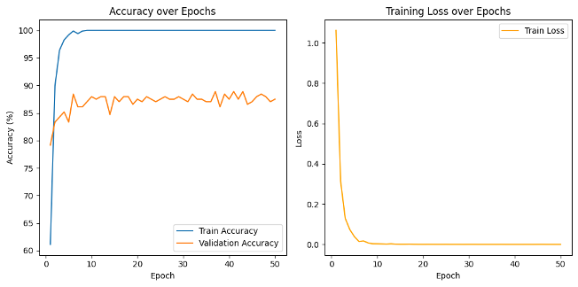

The training graphs for **VGG16** show excellent performance. The validation accuracy (orange line) climbs steadily and converges near the training accuracy, reaching a high value. Similarly, the validation loss decreases consistently and stabilizes. This indicates that the model learned effectively and generalized well to the unseen validation data without significant overfitting.

### CustomCNN (Lower-Performing Model)

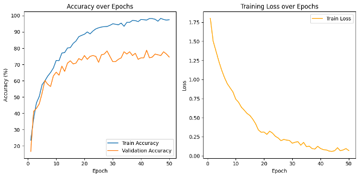

In contrast, the **CustomCNN** model's performance was significantly weaker. The graph shows a much lower final validation accuracy and a higher validation loss. The gap between the training and validation curves suggests that the simple, custom-built architecture struggled to learn the complex patterns in the data and did not generalize as effectively as the deeper, pre-trained VGG16 model.

## 🤖 Model Evaluation: Confusion Matrices

A **confusion matrix** is a table used to visualize the performance of a classification model. It shows a detailed breakdown of correct and incorrect predictions for each class.

* **The Diagonal**: Each cell on the main diagonal (from top-left to bottom-right) represents the number of **correct predictions** for that class. Higher numbers here are better.
* **Off-Diagonal**: Cells off the diagonal represent **misclassifications** or "confusion." For example, the cell at (Row 2, Column 1) shows how many times the model incorrectly predicted Class 1 when the true answer was Class 2. Lower numbers here are better.

A perfect model would have non-zero values only on the diagonal. By analyzing the off-diagonal values, we can understand which specific classes the model struggles to differentiate between. 

---

### DinoV2 (High-Performing Model)

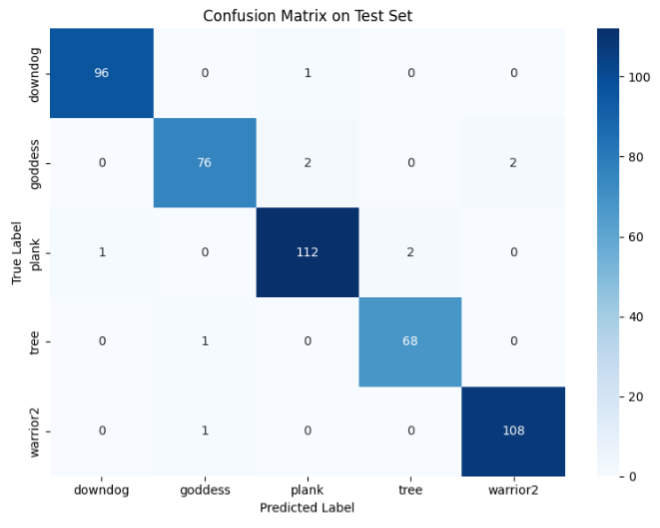

The confusion matrix for **DinoV2** confirms its high accuracy. The diagonal values are overwhelmingly dominant, indicating that the model correctly classified the vast majority of test images for all five yoga poses. The off-diagonal cells have very low values, showing minimal confusion between classes and highlighting the model's excellent discriminative ability.

### CustomCNN (Lower-Performing Model)

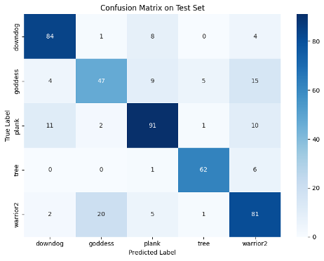

In contrast, the **CustomCNN's** confusion matrix clearly illustrates its weaker performance. While there are still correct predictions along the diagonal, the off-diagonal cells contain significantly higher numbers. This indicates a much higher rate of misclassification across multiple poses, which aligns with the model's lower overall accuracy score. This matrix helps pinpoint exactly which poses the simple CNN architecture found most difficult to distinguish.

### 2. Explainability

We used Grad-CAM to visualize what parts of an image the models focus on to verify that they are learning relevant features of the yoga poses. Below are the explainability maps for the `downdog` pose across different models.

* **VGG16 (Full Train vs. Fine-Tune)**: The fully trained model shows a strong, continuous focus on the hips and arms, while the fine-tuned version emphasizes the back and hips.
    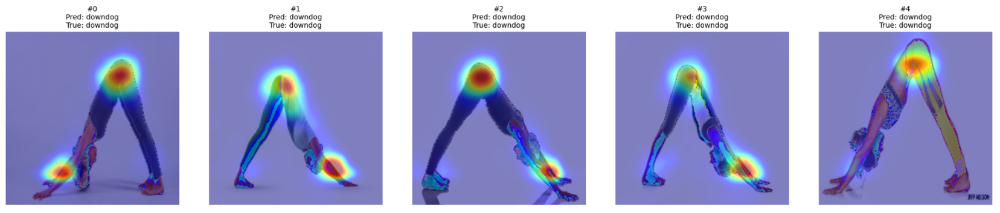
    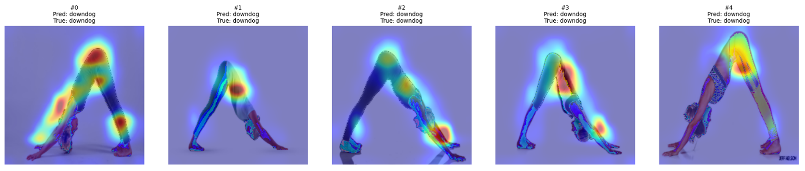

* **ResNet18 & GoogLeNet (Full Train)**: ResNet18 has a balanced focus on the entire "V" shape of the pose, whereas GoogLeNet centralizes its focus on the hip and back area.
    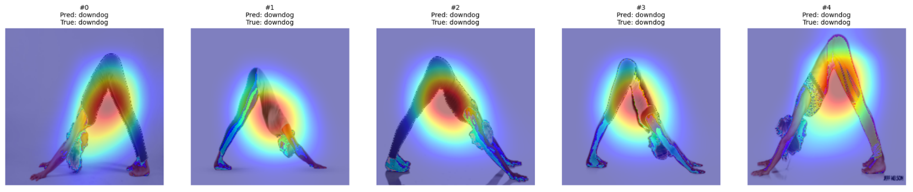
    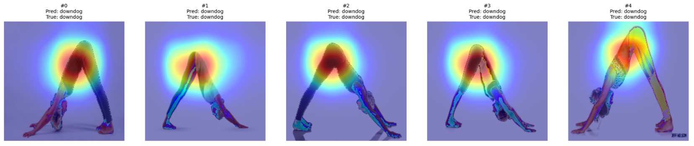

* **AlexNet (Full Train vs. Fine-Tune)**: The fully trained AlexNet focuses on the hands, shoulders, and back. The fine-tuned version is more scattered, with a narrower focus on the hips and upper legs.
    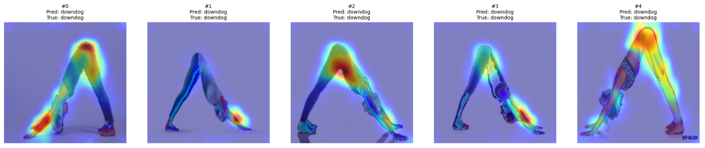
    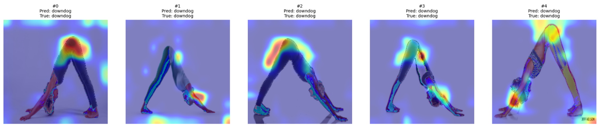

* **ViT-Base & DINOv2**: Both ViT models cover the entire body in their focus maps. DINOv2 produces a sharper focus on limb joints and symmetrical posture, suggesting stronger spatial awareness.
    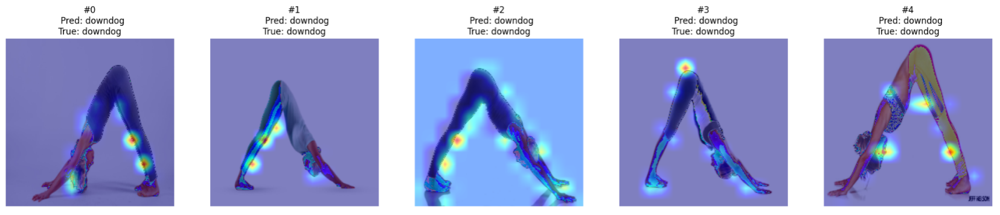
    

* **CustomCNN**: The custom model shows dispersed and inconsistent focus, often including background regions, which correlates with its lower accuracy.
    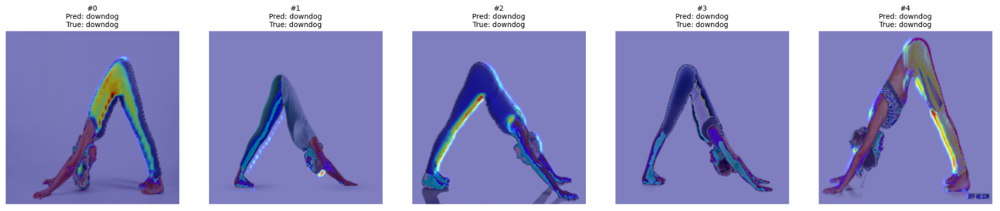

* **PoseGNN**: Instead of a heatmap, PoseGNN's explainability identifies critical joints like the wrists, shoulders, hips, and ankles that define the pose, offering a structural interpretation.
    

### 3. Robustness to Noise

We evaluated all models under varying levels of Gaussian noise. Models trained from scratch generally showed better robustness than fine-tuned versions. ViT models were also highly robust, while the PoseGNN was more sensitive to noise as it disrupts keypoint detection.


## 🎯 Conclusions

This project provides a comprehensive analysis of neural network architectures for yoga pose classification, moving beyond accuracy to include explainability and robustness.

* **Performance**: Deeper architectures like **VGG16** and **DINOv2** are superior for this task. For CNNs, **training from scratch** on the specific dataset proved more effective than fine-tuning pre-trained models.
* **Explainability**: The best-performing models (CNNs and ViTs) focus on relevant anatomical regions. PoseGNN offers a complementary, structural interpretation by identifying key joints. The analysis confirms that higher accuracy often correlates with more meaningful and consistent model focus.
* **Robustness**: Fully trained CNNs and ViT models demonstrate strong resilience to noise. This highlights that the training strategy and architecture choice are critical for developing models that can perform reliably in real-world conditions where image quality may vary.

## ⚙️ Hyperparameters

The following shared hyperparameters were used during training:
* **Loss Function**: `nn.CrossEntropyLoss`
* **Optimizer**: `Adam` for most models, `AdamW` for PoseGNN
* **Epochs**: 50
* **Batch Size**: 32

## 🚀 How to Use

Follow these steps to set up the dataset and run the code.

### 1. Download the Dataset

First, you need to download the dataset from its official source on Kaggle.

* **Download from:** [Yoga Pose Dataset on Kaggle](https://www.kaggle.com/datasets/aayushmishra1512/yoga-pose-dataset)

After downloading, unzip the contents into your project's root directory.

### 2. Directory Structure

The code expects the dataset to be organized in the following folder structure:

* `📄 your_training_script.py`
* `📁 yoga_aayush/`
    * `📁 DATASET/`
        * `📁 TRAIN/` (contains subfolders for each pose: `downdog`, `goddess`, etc.)
        * `📁 TEST/` (has the same structure as the TRAIN folder)

### 3. Load the Dataset in Your Code

You can use the `YogaPoseDataset` class to load the training and testing. Make sure you have defined your `transform_train` and `transform_eval` functions for data augmentation and normalization.

Here is an example of how to instantiate the datasets:

```python
# First, define your transformations for training and evaluation
# transform_train = ...
# transform_eval = ...

# Create the dataset objects
full_train_dataset = YogaPoseDataset("./yoga_aayush/DATASET/TRAIN", transform=transform_train)
test_dataset = YogaPoseDataset("./yoga_aayush/DATASET/TEST", transform=transform_eval)

# You can now use these datasets with PyTorch's DataLoader
# train_loader = DataLoader(full_train_dataset, batch_size=32, shuffle=True)
# test_loader = DataLoader(test_dataset, batch_size=32, shuffle=False)
# val_loader = DataLoader(val_dataset, batch_size=32, shuffle=False)
```
### 4. Run the script. 

python your_training_script.py

Alteranatively you can run the script from the Jupiter notebook itself.

## 📚 References

* **Dataset**: Yoga Pose Dataset on Kaggle. [Link](https://www.kaggle.com/code/aayushmishra1512/yoga-pose-detection/input)
* Selvaraju, R. R., et al. "Grad-CAM: Visual explanations from deep networks via gradient-based localization." *ICCV*, 2017.
* Chattopadhyay, A., et al. "Grad-CAM++: Improved visual explanations for deep convolutional networks." *WACV*, 2018.
* Dosovitskiy, A., et al. "An image is worth 16x16 words: Transformers for image recognition at scale." *ICLR*, 2021.
