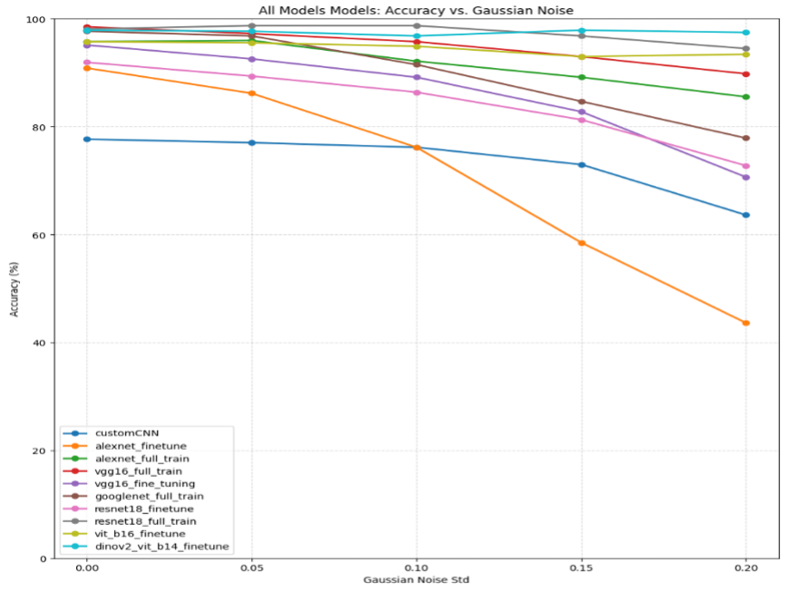
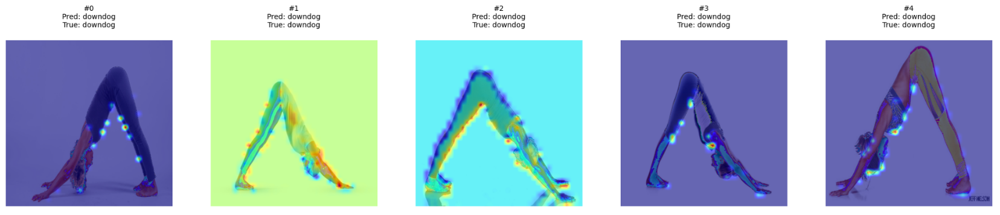
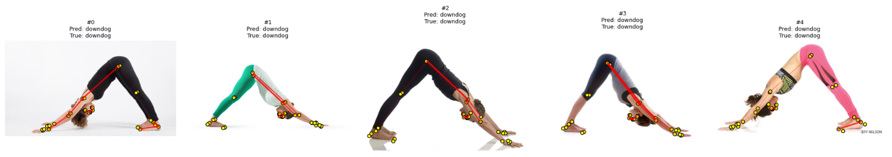

# Beyond Accuracy: Comparative Analysis of Neural Network Architectures, Explainability, and Robustness in Yoga Pose Classification

This repository contains the code and report for a deep learning project that goes beyond traditional accuracy metrics to provide a holistic evaluation of various neural network architectures for yoga pose classification. This project systematically compares multiple well-known neural network architectures, focusing not only on **accuracy** but also on **explainability** and **robustness**.

## 🧘‍♀️ Project Goal

The primary goal of this project is to move beyond the standard accuracy metric and explore:

* **Comparative Analysis**: A systematic evaluation of accuracy, hyperparameters, and other performance metrics across different neural network architectures.
* **Explainability**: Utilization of Grad-CAM and Grad-CAM++ to visualize and understand the focus of the models, ensuring they are making decisions based on meaningful features.
* **Robustness to Gaussian Noise**: Testing the models' performance under varying levels of Gaussian noise to assess their resilience and reliability in non-ideal conditions.

## Dataset

The project uses a curated dataset of five yoga poses:
* Downdog
* Goddess
* Plank
* Tree
* Warrior2

The dataset is split into training, validation, and test sets. To improve generalization and reduce overfitting, the training data is augmented with techniques like random resized cropping, horizontal flipping, rotation, and color jittering.

## 🧠 Models Explored

This project explores three distinct families of models:

1.  **Convolutional Neural Networks (CNNs)**: We used transfer learning for established CNN architectures, replacing the final classifier to fit the five yoga poses. The analyzed architectures include:
    * **AlexNet**, **VGG16**, **GoogLeNet**, **ResNet18**, and a **CustomCNN**.

2.  **Vision Transformers (ViTs)**: ViTs treat an image as a sequence of patches, which are then processed by a Transformer encoder, allowing for global context modeling. The project explores:
    * **ViT-Base** and **DINOv2**.

3.  **Graph Neural Networks (GNNs)**: GNNs analyze the body's structural representation by first extracting 2D keypoints (joints) and then connecting them to form a skeletal graph. The model explored is:
    * **PoseGNN**, which classifies poses by learning the relational patterns between body parts.

---

## 📈 Key Results and Insights

A central theme of this project is that accuracy alone doesn't tell the whole story. By evaluating our models on explainability and robustness, we gain deeper insights into their behavior.

### 1. Overall Robustness to Noise

When tested against increasing levels of Gaussian noise, the models showed significant differences in performance. The **DINOv2** model proved to be exceptionally robust, maintaining high accuracy even under severe noise conditions, while other models like the Custom CNN and AlexNet degraded much more quickly. This highlights the value of advanced pre-training methods.



### 2. Explainability: How Do Models "See" a Pose?

We used explainability techniques to visualize what parts of an image the models focus on. This helps verify that the models are learning relevant features of the yoga poses.

* **Vision Transformer (DINOv2)**: The heatmap shows that DINOv2, a powerful ViT model, focuses on the entire silhouette and core areas of the body to make its classification. Its attention is broad and contextual.

    

* **Graph Neural Network (PoseGNN)**: In contrast, the PoseGNN first creates a skeletal graph from the image. Its "explanation" highlights the specific joints and limbs that were most influential for its decision, providing a more structural and anatomically-based insight.

    

---

## 🛠️ Getting Started

### Prerequisites

You will need Python 3 and the following libraries. You can install them using pip:

```bash
pip install torch torchvision tqdm matplotlib scikit-learn seaborn numpy timm mediapipe opencv-python torch-geometric
